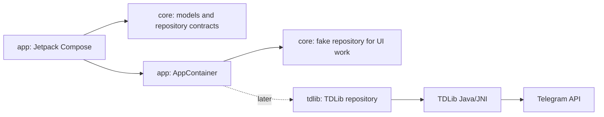

# Architecture

## Android-First Shape

## Modules

- `app`: Android entry point, Compose UI, dependency wiring.
- `core`: pure Kotlin contracts and models. No Android dependency.
- `tdlib`: Android library boundary for real TDLib integration.

## Why Kotlin

Kotlin is the best main language for this app because Android tooling treats it as a first-class language, Compose is built around Kotlin APIs, and TDLib's Java interface is straightforward to call from Kotlin.

## Why TDLib

Bot API is for bots, not a personal user-account Telegram client. A third-party client needs Telegram API credentials and a client engine such as TDLib. TDLib handles network, encryption, local database, update ordering, and unreliable connections, so it is the right engine for an Android client.

## Future macOS

Do not build macOS yet. If we add it later, keep `core` shared and create a separate desktop client. TDLib is cross-platform, so the adapter idea still works.

## Privacy Defaults

- Keep API credentials and sessions local.
- Store TDLib database under app-private storage.
- Use Android Keystore for any app-level secret material added later.
- Never automate spam, scraping, hidden reads, fake engagement, or account actions without visible user intent.
