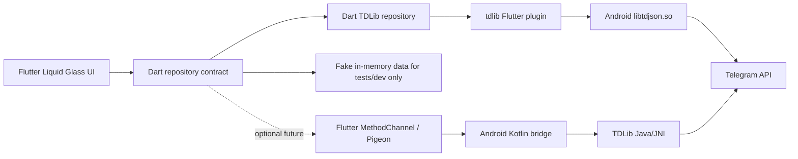

# Architecture

## Flutter Android Shape

## Main Areas

- `lib/`: Flutter app shell, Liquid Glass screens, real TDLib repository, fake test repository, models, and platform bridge interface.
- `android/`: Android host app and optional deeper TDLib native integration.
- `docs/`: architecture and branch coordination notes.

## Why Flutter Now

The desired UI is close to `sdegenaar/liquid_glass_widgets`, which is a Flutter package. Switching now lets us use that UI system directly instead of rebuilding the whole effect in Jetpack Compose.

## UI Direction

Screens should follow Telegram Android structure and interaction patterns first: phone login with country code selection, chat list top bar/search/FAB, conversation app bar, message bubbles, and composer. Liquid Glass is a skin for bars, sheets, composer surfaces, and selected emphasis; it should not replace the official Android information architecture with a separate demo-style layout.

## TDLib Login

`TdlibTelegramRepository` owns the current real login path. It initializes `libtdjson.so` on Android, stores TDLib data under app-private support directories, handles authorization state updates, submits phone/code/2FA password, and calls `getMe` for the signed-in profile.

For a private build, `TELEGRAM_API_ID` and `TELEGRAM_API_HASH` can be embedded with `--dart-define`, which gives the same app UX as a third-party client with built-in credentials. If no embedded credentials are present, the login form asks once for API ID/hash and stores them through `flutter_secure_storage`.

## Why Keep Android Native

The Kotlin MethodChannel skeleton remains useful for future lower-level TDLib work, performance tuning, or Android-only security features. Flutter should own presentation and app flow; platform-specific engine details should stay behind a narrow typed boundary.

## Future macOS

Do not build macOS yet. If we add it later, Flutter can add a macOS target for the UI. TDLib setup should still be platform-specific behind the same Dart repository shape.

## Privacy Defaults

- Keep API credentials and sessions local.
- Store TDLib database under app-private Android storage.
- Use Android Keystore for any app-level secret material added later.
- Do not automate spam, scraping, hidden reads, fake engagement, or account actions without visible user intent.
