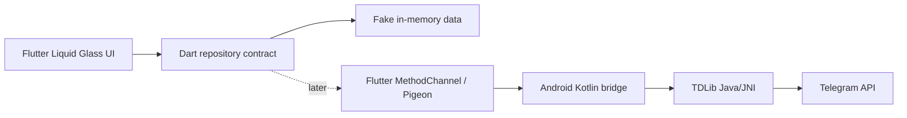

# Architecture

## Flutter Android Shape

## Main Areas

- `lib/`: Flutter app shell, Liquid Glass screens, fake repository, models, and platform bridge interface.
- `android/`: Android host app and future TDLib native integration.
- `docs/`: architecture and branch coordination notes.

## Why Flutter Now

The desired UI is close to `sdegenaar/liquid_glass_widgets`, which is a Flutter package. Switching now lets us use that UI system directly instead of rebuilding the whole effect in Jetpack Compose.

## Why Keep Android Native

TDLib is still best wired through native Android. Flutter should own presentation and app flow; the Android layer should own TDLib libraries, session directories, authorization updates, and low-level Telegram calls. Flutter talks to it through a narrow typed bridge.

## Current Baseline

The baseline intentionally uses a fake repository. That lets the Liquid Glass UI, responsive chat layout, and branch structure progress while TDLib native build details are handled separately.

## Future macOS

Do not build macOS yet. If we add it later, Flutter can add a macOS target for the UI. TDLib setup should still be platform-specific behind the same Dart repository shape.

## Privacy Defaults

- Keep API credentials and sessions local.
- Store TDLib database under app-private Android storage.
- Use Android Keystore for any app-level secret material added later.
- Do not automate spam, scraping, hidden reads, fake engagement, or account actions without visible user intent.
